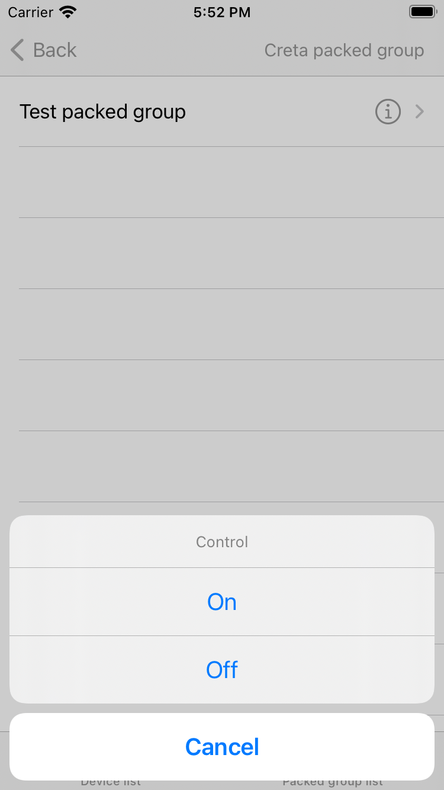

#  商用照明 iOS SDK


[](https://www.apple.com/nl/ios/)

[中文版](README-zh.md) | [English](README.md)

---

## 功能概述

涂鸦商用照明 App SDK iOS 版是一套针对商用照明领域开发的 iOS 解决方案。您可以基于 SDK 快速实现商用照明及关联场景的 App 功能开发，实现对项目、区域以及设备的管理和控制等操作。

SDK 主要包括以下功能：

- 用户体系
  - 用户的登录、注册等操作
  - 支持手机号码和邮箱等账号体系
  - 支持修改密码、账号注销等操作
  - 支持更新用户相关信息如昵称等
- 项目管理
  - 支持项目的创建、更新、修改、查询等操作
  - 支持获取项目详情
  - 支持户外项目的创建、编辑、删除等操作
- 区域管理
  - 支持区域的增加、删除、修改、查询等操作
  - 支持区域群控
  - 支持获取项目下区域列表以及区域下的子区域列表
  - 支持区域层级的动态配置
  - 获取区域下设备列表
- 群组管理
  - 支持组合群组的创建、编辑、删除、查询等操作
  - 支持组合群组的群控操作
- 能耗统计
  - 支持设备能耗数据的统计
- 设备报修
  - 支持设备报修功能
  - 支持报修工单查询操作
  - 支持设备告警查询功能


## 快速集成

### 使用 Cocoapods 集成

在 `Podfile` 文件中添加以下内容（Cocoapods 请使用 1.10.1 及以上版本）：

```ruby
platform :ios, '10.0'

target 'your_target_name' do

   pod "TuyaSmartCommercialLightingSdk"

end
```

然后在项目根目录下执行 `pod update` 命令，集成第三方库。

CocoaPods 的使用请参考：[CocoaPods Guides](https://guides.cocoapods.org/)

## 初始化 SDK

1. 打开项目设置，Target => General，修改 `Bundle Identifier` 为涂鸦开发者平台对应的 iOS 包名
2. 导入安全图片到工程根目录，重命名为 `t_s.bmp`，并加入「项目设置 => Target => Build Phases => Copy Bundle Resources」中。

3. 在项目的 `PrefixHeader.pch` 文件添加以下内容：

```objective-c
#import <TuyaSmartCommercialLightingSdk/TuyaSmartCommercialLightingSdk.h>
```

打开 `AppDelegate.m` 文件，在 `[AppDelegate application:didFinishLaunchingWithOptions:]` 方法中初始化 SDK：

```objective-c
[[TuyaSmartSDK sharedInstance] startWithAppKey:<#your_app_key#> secretKey:<#your_secret_key#>];
```

至此，准备工作已经全部完毕，可以开始App开发啦。


<p> 	  </p>


## 开发文档

更多请参考: [商用照明 App SDK iOS 版](https://developer.tuya.com/cn/docs/app-development/commercial-lighting-app-sdk-for-ios?id=Kalj8f5wlhcsz)

## 版本更新记录

[发布日志](https://developer.tuya.com/cn/docs/app-development/ios-saas-lighting-changelog?id=Kaoywk53lua7r)
