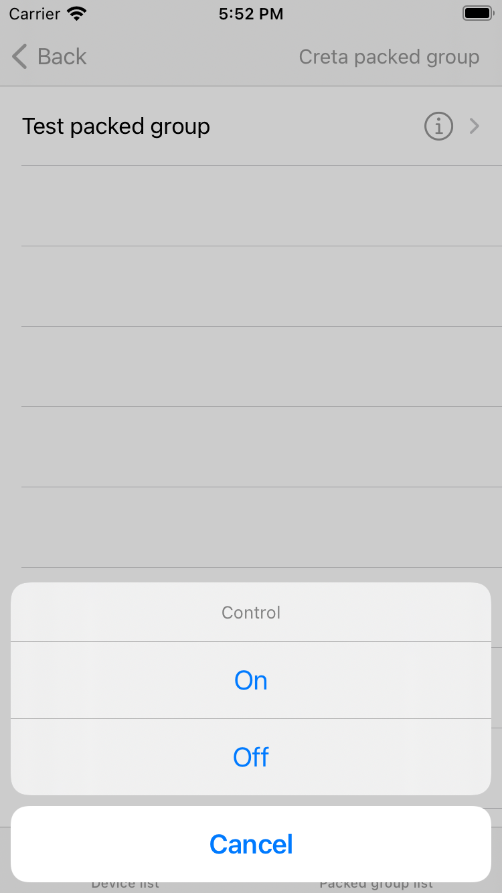

# Tuya Smart Commercial Lighting SDK


[](https://www.apple.com/nl/ios/)


[English](README.md) | [中文版](README-zh.md)

---

## Overview

Tuya Commercial Lighting App SDK for iOS is dedicated to commercial lighting development solutions on iOS. It helps you quickly implement app functionality suitable for commercial lighting and scene linkage. With your app, users can manage projects, areas, and devices

The SDK includes the following functions:

- Users
  - Log in and register
  - User accounts registered with mobile phone numbers or email addresses
  - Change passwords and sign out of accounts
  - Update user information, such as nicknames
- Projects
  - Create, update, modify, and query projects
  - Get project details
  - Create, edit, and delete outdoor projects
- Areas
  - Add, query, modify, and delete areas
  - Control area groups
  - Get a list of areas of a project and a list of sub-areas of a specific area
  - Dynamically configure area levels
  - Get a list of devices that belong to a specific area
- Groups
  - Create, query, edit, and delete groups
  - Control groups
- Energy statistics
  - Energy consumption dashboard
- Device maintenance
  - Maintenance request
  - Query maintenance reports
  - Query device alerts

## Efficient integration

### Use CocoaPods integration (version 1.10.1 or later is supported)

Add the following content in the file `Podfile`:

```ruby
platform :ios, '10.0'

target 'your_target_name' do

      pod "TuyaSmartCommercialLightingSdk"

end
```

Execute the command `pod update` in the project's root directory to begin integration.

For more information about CocoaPods, see [CocoaPods Guides](https://guides.cocoapods.org/).

## Initialize the SDK

1. Open the project to apply the setting, `Target => General`, and set `Bundle Identifier` to the value from the Tuya developer center.
2. Import a security image to the project, rename it as `t_s.bmp`, and then add it to `Project Setting => Target => Build Phases => Copy Bundle Resources`.
3. Add the following content to the project file `PrefixHeader.pch`：

```objective-c
#import <TuyaSmartCommercialLightingSdk/TuyaSmartCommercialLightingSdk.h>
```

4. Open the file `AppDelegate.m`，and use the `App ID` and `App Secret` that are obtained from the development platform in the `[AppDelegate application:didFinishLaunchingWithOptions:]` method to initialize the SDK:

```objective-c
[[TuyaSmartSDK sharedInstance] startWithAppKey:<#your_app_key#> secretKey:<#your_secret_key#>];
```

All the preparation steps are finished. You can use the SDK to develop your application.

<p> 	  </p>


## References

For more information, see:
* [Tuya Smart Commercial Lighting SDK Doc](https://developer.tuya.com/en/docs/app-development/commercial-lighting-app-sdk-for-ios?id=Kalj8f5wlhcsz)

* [API Reference](https://appdoc-cn.tuya-inc.com:7799/TuyaSmartCommercialLightingSdk/1.9.6/)


## Changelog

[Change Log](https://developer.tuya.com/en/docs/app-development/ios-saas-lighting-changelog?id=Kaoywk53lua7r)


## Support

You can get support from Tuya Smart by using the following methods:

Tuya Smart Help Center: https://support.tuya.com/en/help

Technical Support Console: https://service.console.tuya.com

## License

This Tuya Smart Commercial Lighting SDK Sample is licensed under the MIT License.
